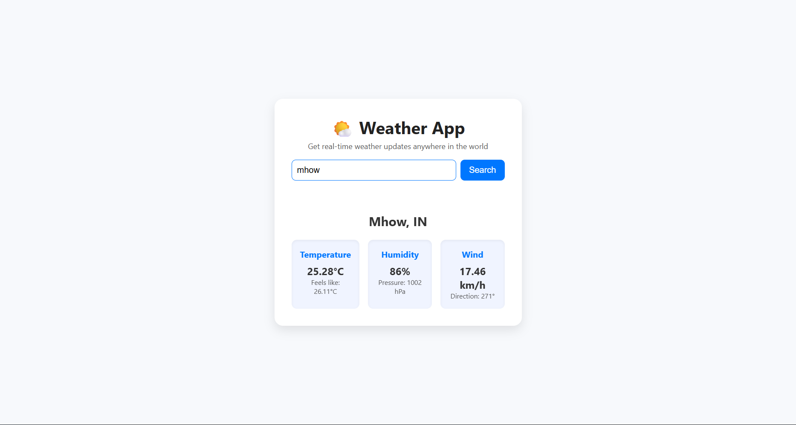

# 🌦️ Weather App

A simple and elegant **Weather Application** built with **HTML, CSS, and JavaScript** that fetches real-time weather data using the **OpenWeatherMap API**.  
The app allows users to search for any city worldwide and displays the **current temperature, weather conditions, humidity, wind speed, and more** in a modern UI.

---

## 🚀 Features
- Search weather by **city name**
- Displays **temperature, feels-like, humidity, pressure, wind speed & direction**
- Clean **light theme card UI** with responsive design
- **Error handling** for invalid or unknown cities
- Powered by **OpenWeatherMap API**
  
---

## 🛠️ Tech Stack
- **HTML5**
- **CSS3**
- **JavaScript (ES6)**
- **OpenWeatherMap API**
  
---

## 📸 Screenshot
Here’s how the app looks:  

---

## 🌐 Live Demo
👉 [Click here to try it out](https://ayushbadola74.github.io/PRODIGY_WD_05/)

